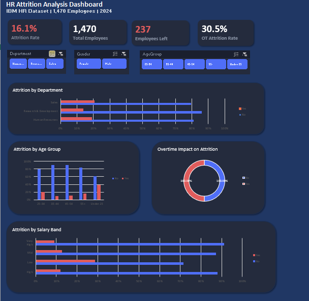

HR Attrition Analysis Dashboard

1.Project Overview
An interactive Excel dashboard analyzing employee attrition 
patterns across 1,470 employees using the IBM HR Analytics 
dataset. Built to answer the business question:
"Why are employees leaving and which groups are most at risk?"

2.Business Questions Answered
- What is the overall attrition rate?
- Which department has the highest attrition?
- Does overtime increase attrition risk?
- Which age group leaves the most?
- Does salary level affect attrition?

3.Key Insights Found
- Overall attrition rate is 16.1% (237 out of 1,470 employees)
- Sales department has the highest attrition at 20.6%
- Employees working overtime have 3x higher attrition (30.5% vs 10.4%)
- Under 25 age group has the highest attrition at 38%
- Low salary band employees have 29% attrition vs 7% for Very High band

4.Tools Used
- Microsoft Excel
- Power Query (data cleaning)
- Pivot Tables (analysis)
- Excel Charts (visualization)
- Slicers (interactivity)

5.Dataset
IBM HR Analytics Employee Attrition Dataset
Source: Kaggle
Records: 1,470 employees | 31 columns (after cleaning)

6.Dashboard Features
- 4 dynamic KPI cards
- 4 interactive charts
- 3 slicers (Department, Gender, Age Group)
- Dark themed professional design
- All charts connected to slicers for dynamic filtering

7.Skills Demonstrated
- Data cleaning with Power Query
- Exploratory analysis with Pivot Tables
- Dashboard design and layout
- Business insight generation
- Data storytelling
