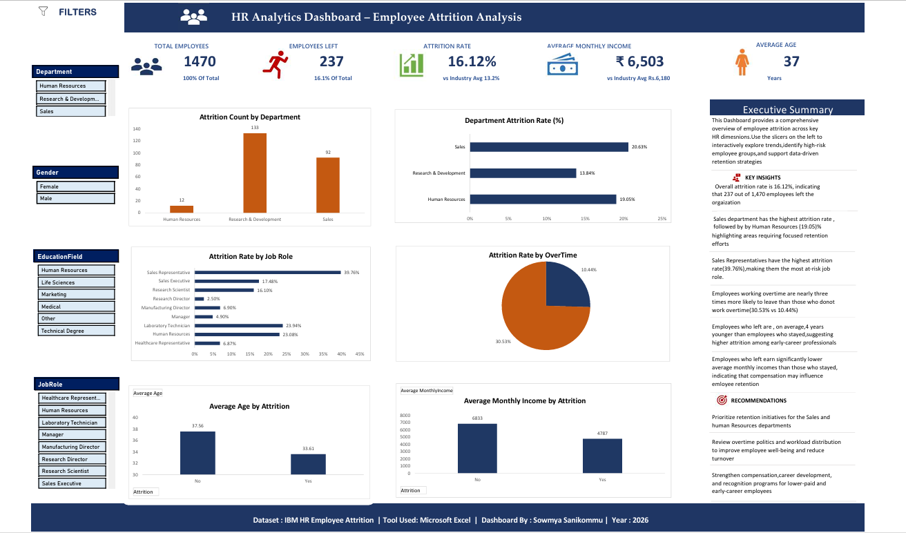

📊 HR Analytics Dashboard — Employee Attrition Analysis

> Identifying why employees leave — and what the business can do about it.



---

📌 Project Overview

Employee attrition is one of the most costly and disruptive challenges in human resources management. Replacing a single employee can cost between **50% to 200% of their annual salary** when factoring in recruitment, onboarding, and lost productivity.

This project analyzes **1,470 employee records** from IBM's HR dataset to uncover the root causes of attrition, identify high-risk employee segments, and provide data-driven recommendations that HR leadership and business managers can act on immediately.

The final deliverable is a **fully interactive Excel dashboard** that allows stakeholders to filter by Department, Gender, Education Field, and Job Role — answering real business questions without requiring any technical knowledge.

---

🎯 Business Questions Answered

| # | Business Question | Answer |
|---|---|---|
| 1 | What is the overall attrition rate? | **16.12%** — above the industry avg of 13.2% |
| 2 | Which department loses the most employees? | **Sales** — 20.63% attrition rate |
| 3 | Which job role is most at risk? | **Sales Representatives** — 39.76% attrition |
| 4 | Does overtime cause higher attrition? | Yes — **30.53%** vs **10.44%** without overtime |
| 5 | Do younger employees leave more? | Yes — leavers avg **33.6 yrs** vs stayers **37.6 yrs** |
| 6 | Does salary influence attrition? | Yes — leavers earn avg **₹4,787** vs **₹6,833** for stayers |

---

💡 Key Insights

- **Overall attrition is 16.12%** (237 out of 1,470 employees), exceeding the industry benchmark of 13.2% — indicating a systemic retention problem rather than isolated cases.

- **Sales department drives the highest volume of attrition** (133 employees), followed by Research & Development (92) and Human Resources (12). Sales also has the highest attrition *rate* at 20.63%.

- **Sales Representatives are the most at-risk job role** with a 39.76% attrition rate — nearly 1 in 3 Sales Reps leave. This suggests role-specific factors such as target pressure, compensation structure, or growth opportunities.

- **Overtime is a critical attrition driver.** Employees who work overtime leave at nearly 3× the rate of those who do not (30.53% vs 10.44%), pointing directly to burnout and work-life balance issues.

- **Younger, lower-paid employees are disproportionately leaving.** Leavers are on average 4 years younger and earn ₹2,046/month less than those who stay — highlighting an early-career retention gap.

---

✅ Recommendations

### 1. Immediate: Target Sales & HR Retention Programs
Design targeted retention initiatives for Sales Representatives and HR staff — the two highest-risk groups. Consider structured career progression paths, competitive compensation reviews, and regular feedback cycles.

### 2. Short-term: Audit and Revise Overtime Policies
The 3× higher attrition rate among overtime employees is a clear signal of burnout risk. Implement workload audits, enforce overtime limits, and pilot flexible work arrangements in high-overtime departments.

### 3. Medium-term: Strengthen Early-Career Value Proposition
With leavers averaging 4 years younger than stayers, the organization is losing early-career talent before they reach peak productivity. Invest in mentoring programs, transparent promotion timelines, and compensation benchmarking for junior roles.

---

🗂️ Project Structure

```
IBM-HR-Attrition-Dashboard/
│
├── 📊 dashboard/
│     └── IBM_HR_Attrition_Dashboard.xlsx     ← Interactive Excel Dashboard
│
├── 📁 data/
│     └── HR_Attrition_Raw_Data.csv           ← Source dataset (1,470 records)
│
├── 🖼️ screenshots/
│     └── dashboard_preview.png               ← Dashboard preview image
│
├── 📄 report/
│     └── Project_Report.pdf                  ← Full analytical report
│
├── 📝 interview_prep/
│     └── Interview_Questions_Answers.md      ← Q&A for interviews
│
└── README.md                                 ← You are here
```

---

🛠️ Tools & Techniques Used

| Tool / Technique | Purpose |
|---|---|
| Microsoft Excel | Primary analysis and dashboard tool |
| Pivot Tables | Data aggregation and multi-dimensional analysis |
| Pivot Charts | Visual representation of insights |
| Slicers | Interactive filtering by Department, Gender, Education, Job Role |
| KPI Cards | Executive-level headline metrics |
| Conditional Formatting | Visual risk indicators |
| Data Cleaning | Duplicate removal, data type standardization, null handling |

---

📊 Dashboard Features

- **5 KPI Cards** — Total Employees, Employees Left, Attrition Rate, Avg Monthly Income, Avg Age — each benchmarked against industry averages
- **6 Interactive Charts** — Department attrition count, department attrition rate, attrition by job role, overtime impact, average age by attrition, income by attrition
- **4 Slicers** — Department, Gender, Education Field, Job Role — fully interconnected
- **Executive Summary Panel** — Key insights and recommendations readable in under 60 seconds
- **Professional Footer** — Dataset source, tool used, analyst name, year

---

📈 Dataset

| Property | Detail |
|---|---|
| Source | IBM HR Analytics Employee Attrition & Performance (Public Dataset) |
| Records | 1,470 employees |
| Features | 35 columns including Age, Department, JobRole, MonthlyIncome, OverTime, Attrition |
| Availability | Publicly available — no confidential data |

---

🚀 How to Use the Dashboard

1. Download `dashboard/IBM_HR_Attrition_Dashboard.xlsx`
2. Open in "Microsoft Excel 2016 or later" (slicers require desktop Excel)
3. Use the "slicers on the left panel" to filter by Department, Gender, Education Field, or Job Role
4. All charts and KPI cards update dynamically with each selection
5. Reset all filters by clicking the funnel icon (↑ top-left of each slicer)

---

👩‍💻 About This Project

This project was completed as part of a self-directed **Data Analytics Portfolio** initiative, simulating a real business analytics assignment for an HR leadership team.

The goal was not simply to demonstrate Excel proficiency, but to develop the full analyst workflow:
Business question → Data exploration → Insight generation → Visual communication → Recommendations

---
## Author

**Sowmya Sanikommu**
| Aspiring Data Analyst | Excel | PostgreSQL | Business Intelligence | Power BI

---

*Dataset: IBM HR Employee Attrition (Public) | Tool: Microsoft Excel | Year: 2026*
